# Research Project Gameplay Programming
## Regression
### 1 Goal

The purpose of this research is to broaden my knowledge about artificial intelligence (AI), more specifically, **regression**. This will be done by implementing a set of exercises with both self-generated data and existing datasets to get a better grasp of the subject. Both advantages and drawbacks will be discussed for each type of regression analysed during this research.

### 2 Regression
Modern AI's are machine learning solutions created for a **specific task**. This can vary from understanding and analysing trends in market shares to finding the optimal location for a pizza shop. These AI's aren't considered *real intelligence* but use statistics and analytics to handle different problems dependant on their given training.
The way that such AI's learn can be subdivided into three categories:
* *Supervised Learning*, in which the algorithms are trained for a specific task with pre-existing datasets and human supervision.
* *Unsupervised learning*, where the algorithm looks for previously undetected patterns in pre-existing datasets with as less human supervision as possible.
* *Reinforcement Learning*, in which the algorithms learn using trial and error by adding positive and negative values to experiences and situations.

AI's that combine different aspects of learning also exist but are out of the scope of this research.

#### 2.1 Supervised Learning
The most relevant training method for this research is *Supervised Learning*. During supervised learning the goal is to approximate a mapping function *f* from input *x* to output *Y* using algorithms. 

Y = f(x) 

This method is referred to as supervised learning because the creator knows what the correct answers need to look like. While the algorithm makes predictions on the training data, the creator will correct if it is necessary. When a certain level of accuracy is achieved, the learning stops. Supervised learning problems can be subdivided into **classification** and **regression** problems. The output of both problems will, as their name suggests, be different. Classification problems will output a *category* and tries to classify the received datasets. Regression problems, on the other hand, predict a *numeric value in any range* as output variable, such as "height" or "speed".

This research focusses on the different types of regression algorithms, who try to predict dependant values based on known datasets. This is done by looking at the relationship between different values. The following section will explain some of the most commonly used regression algorithms followed by an implementation explaining its use.

#### 2.2 Linear Regression
Linear regressiion is a frequently used method to analyze an available data set. 

##### 2.2.1 Simple Linear Regression
###### General explenation
The most commonly used form of linear regression is known as **least squares fitting**. This form aims to fit a polynomial curve to data, in a way that the sum of squares of the distance from the line to the data points is minimized.

When the least squeres estimator of a linear regression model with a single explanatory variable is called **simple linear regression**. This fits a straight line trough a set of n points in such a way that makes the sum of squared residuals as small as possible. A visualisation of this process can be seen in the following image:

Suppose there are n training samples  <ins>x</ins>i= (1, xi1)T and yi, where i = 1, 2, ... , n. 
These samples represent the input random vector   <ins>X</ins> = (1, Xi)Tand the output random variable Y, respectively.
The following function describes <ins>x</ins> i and yi:

yi = <ins>θ</ins>T <ins>x</ins>i + ϵi = θ0 + θ1x1 + ϵi,

where <ins>θ</ins> = (θ0, θ1)T can be seen as the vector of the parameters and ϵi is the error for a pair
(xi, yi). The objective is to find the equation of the straight line:

Y = θ0 + θ1X1

This provides the most optimal fit for the data points, where the sum of squared residuals are minimized. This would mean that the y-intercept θ0 and the slope θ1 solve the following minimization problem:

By expanding to get a quadratic expression in θ0 and θ1, it can be shown that the minimizing values of θ0 and θ1 of the formula above are:

where x1 = (x11, ... , xi1, ... , xn1) and y = (y11, ... , yi1, ... , yn1) are the row
vectors that contain all sample values of the variables X1 and Y, respectively. Note that the circumflex over a quantity indicates the sample average. For a more detailed description of the simple linear regression theory, I would recommend the following sources:
* Section 3.1, Chapter 3 from the book “Pattern recognition and machine learning” of Bishop and Nasrabadi.
* https://mathworld.wolfram.com/LeastSquaresFitting.html
* Section 1, Chapter 1 from the Lecture notes [Supervised Learning](https://sgfin.github.io/files/notes/CS229_Lecture_Notes.pdf)

###### Implementation: Introduction
>The files of this implementation can be found [here](Simple%20Linear%20Regression/01_Introduction).

To understand the concept of simple linear regression I generated some experimental data adding artificial noise using the equation   y = a0 + a1 * x, where a0 = 2 and a1 = 1. This is shown in the following image, containing a yellow line indicating the computed linear regression:

The regression line is calculated using built-in Matlab functions to quickly get the grasp of the concept.  
By playing with the standard deviation of the errors, it is noticeable  that the calculated regression becomes less accurate.

To simulate the effects of a random experimental error, I've repeated this process 1000 times with a fixed standard deviation of 0,1. By analysing the means in a histogram using a Gaussian curve, as shown in the image below, we notice that a0 is most likely equal to 1, and a1 = 2. Knowing that our basic function was y = 1 + 2x, we can assume that our approach was effective.

##### 2.2.2 Gradient Descent
###### General explenation
Gradient Descent is theoretically an algorithm that minimizes functions. This perfectly fits in the context of regression, where one tries to minimalize the sum of squared residuals. Any function can be defined by a set of parameters <ins>0</ins>. Gradient descent will initialize such a set and gradually move towards a set of parameters to minimize a cost function using calculus.

For each sample <ins>x</ins>i = (1, xi1)T the hypothesis function can be defined as

h(<ins>x</ins>i) = <ins>θ</ins>T <ins>x</ins>i = θ0 + θ1xi1,

or,

h(<ins>x</ins>i) = <ins>x</ins>iT<ins>θ</ins> = θ0 + θ1xi1,

The next step is to figure out the parameters θ = (θ0, θ1)T , which will minimize the square error between the predicted value h(<ins>x</ins>) and the actual output y for all values i in the training set. The cost function can then be noted as followed:

In this formula, n represents the number of training sets. The scaling of 1/2n is simply notational convenience. This can also be rewritten using matrix notations as

To reduce the cost function, θ will need to be updated each iteration  using the following update rule

###### Implementation: Gradient Descent
>The files of this implementation can be found [here](Simple%20Linear%20Regression/02_GradientDescent).

For this implementation, I replicated an exercise provided by the learning platform 'openclassroom' in the course *Machine Learning* found [here](http://openclassroom.stanford.edu/MainFolder/DocumentPage.php?course=MachineLearning&doc=exercises/ex2/ex2.html). This was done by generating my own relevant data and implementing linear regression. The generated data involves children between the ages of 2 and 8 years old and their heights.

The implementation focusses on using the *update rule*  to update θ. In the following image, the red line indicates the first calculated regression line after 1 iteration of the update rule. This is clearly an inaccurate representation of the dataset, but after 1478 iterations, both theta's have convoluted to a fixed value. The regression line found with these theta values is shown by the yellow line.

This regression line can further be used to estimate the average height of children with a specific age, an example can be found in the code.

*Note that it is important to adjust the learning rate with different datasets. This can either make or break the linear regression.*

###### Implementation: Visualisation of Gradient Descent
>The files of this implementation can be found [here](Simple%20Linear%20Regression/02_GradientDescent).

By implementing the definition of the cost function, all possible theta's can be calculated and visualised inside of a surface plot. If this is done using the previously generated dataset the following can be created:

The red line indicates the theta's calculated in the previous example.  
*It is important to note that this red line can be found in the valley of the surface plot, where the cost function is at its lowest.*

#### 2.3 Multivariate Linear Regression
##### General Explenation
It is also possible to analyse the degree of a linear relation of multiple predictors and responses. This is based on the same concept of the previous linear regression but adds extra variables to the field. A detailed description of multivariate regression problems can be found via the following sources:
* Section 2.3.1, Ch. 2 from the book “The Elements of Statistical Learning” of Hastie, Tibshirani and Friedman.
* Section 3.1, Ch. 3 from the book “Pattern recognition and machine learning” of Bishop and Nasrabadi.
* Section 4, Ch. 1 from the Lecture notes [Supervised Learning](https://sgfin.github.io/files/notes/CS229_Lecture_Notes.pdf)

##### Implementation: Multivariate Regression
>The files of this implementation can be found [here](Multivariate%20Linear%20Regression).

This implementation is my method used while following an exercise provided by the learning platform 'openclassroom' in the course *Machine Learning* found [here](http://openclassroom.stanford.edu/MainFolder/DocumentPage.php?course=MachineLearning&doc=exercises/ex3/ex3.html). Because the implementation of multivariate linear regression is very similar to simple linear regression, it focusses a bit more at the influence of the learning rate, which can heavily influence the results, as mentioned at the end of section 2.2.2 **Implementation: Gradient Descent**.

The following graph shows the influence of the learning rates, for the values 0.01, 0.03, 0.1, 0.3, 1, and 1.3.

By analysing the graph, we can assume that a small learning rate will cause the cost function to convolute too slowly. This increases the amount of itteration needed to reach the convoluted value of the cost function. However, This clearly does not mean you can simply increase the learning rate without concequences. By comparing the blue-striped line with the red-striped line, we can see how a higher learningrate can make the convergence slower or even impossible.

Just like in the previous implementation found in section 2.2.2 **Implementation: Gradient Descent**, we can use the generated theta's to predict values. However, Normal equations with regularization are necessary to mitigate the chances of the model "overfitting" the training data, which could happen if we allowed  parameters to grow arbitrarily large.
To regulate a linear regression model, a penalty term is used on the square values. The influence of this penalty term is controlled by the parameter λ.  

With y being the target values, X the input features, and λ the regularization parameter, we can find the close form solution for the regularized linear regression with the  following formula:

<ins>θ</ins>= [XTX + λ * I]-1 XTy

Just like un-regulized linear regression, the predicted values y is calculated by y = X<ins>θ</ins>.
My implementation of the normalization and regularization can be found at the end of the implementation.

#### 2.4 Logistic Regression
##### General Explenation
As mentioned at the beginning of this document in section 2.1, supervised learning problems can be grouped into two main categories, classification and regression problems. Although regression algorithms are obviously made to solve regression problems, logistic regression is e method focussed on classification problems. This **is** however still a regression model. Logistic regression builds a regression model to predict the probability that a given data set belongs to a specific category. These are **binary** classification problems, which means that there are only two options: 0 or 1. The value 1 is often referred to as the positive class, whereas the value 0 the negative class.

Linear regression will assume that data follows a linear function. On the other hand, logistic regression uses the **logistic** function, better known as the **sigmoid** function:

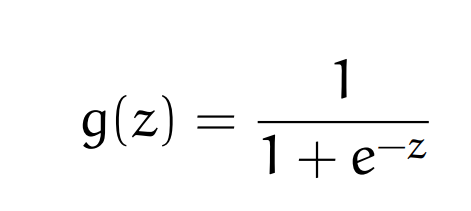 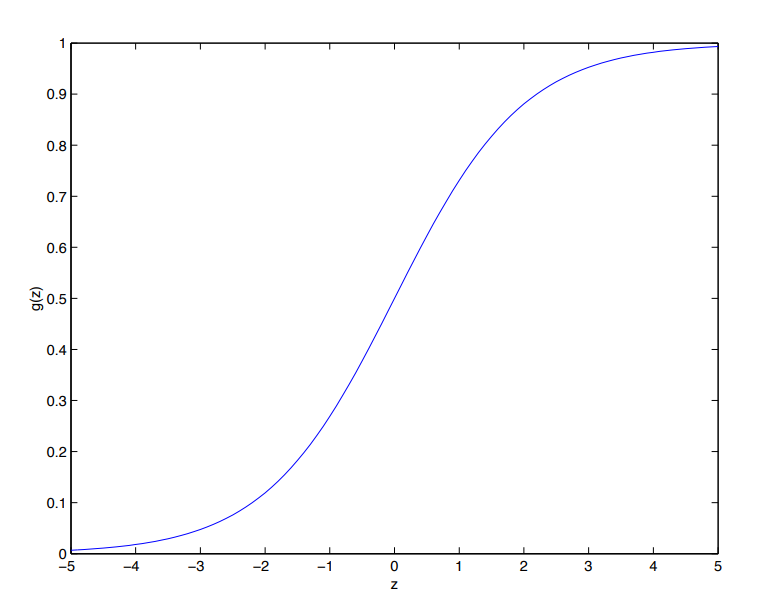

It is important to nota that g(z) tends towards 1 and 0, as z -> ∞ adn z -> -∞ respectively.  

Next up it is important to know how to incorporate θ within the logistic regression model. Assume that P(y = 1|<ins>x</ins>; <ins>θ</ins>) = h(<ins>x</ins>) and  P(y = 0|<ins>x</ins>; <ins>θ</ins>) = 1 − h(<ins>x</ins>). When we have n training examples, we can write the likelihood of the parameters as the following:

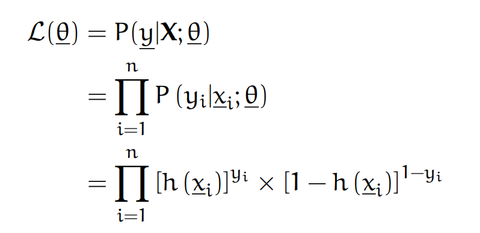

From this point on we can do either one of these two things:
* Maximize the logistic likelihood:

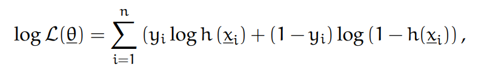

* Minimize the cost function:

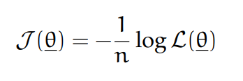

When we tried to minimize the cost function, this can be done similarly to the derivation of linear regression using Gradient Descent. However, an other method called **Newton's method** can also be used.

The update rule of Newton's method makes use of a gradient and a hessian (to describe the local curvature of a function) an can be written as such:

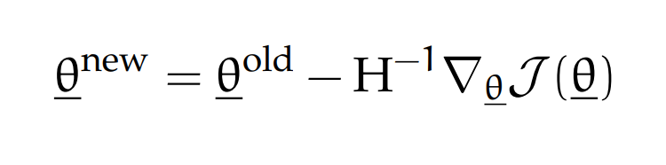

In logistic regression, the Hassian and the gradient are written as followed respectively:

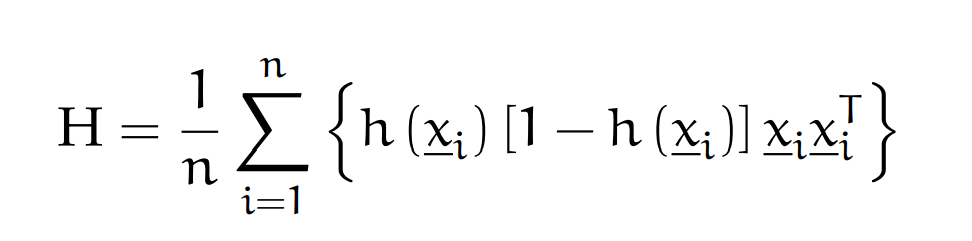

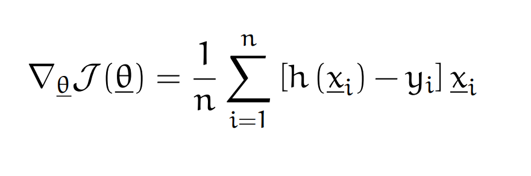

These formulas were the basis used in my implementation in the section bellow.

##### Implementation: Newton’s Method
>The files of this implementation can be found [here](Logistic%20Regression/NewtonsMethod).

This implementation is my method used while following an exercise provided by the learning platform 'openclassroom' in the course *Machine Learning* found [here](http://openclassroom.stanford.edu/MainFolder/DocumentPage.php?course=MachineLearning&doc=exercises/ex4/ex4.html). This implementation focusses on using Newton's method to build a binary classification model to estimate college admission chances based on student scores on two exams. This was done by following the formulas mentioned at the end of section 2.4. 

With the calculated theta's we can create a decision boundary between the admitted and not admitted students. This is done using the formula 

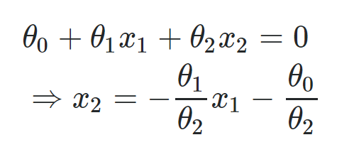

The implementation can be seen in the next image:

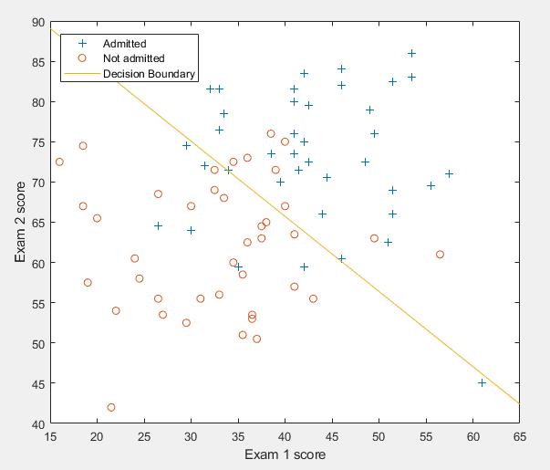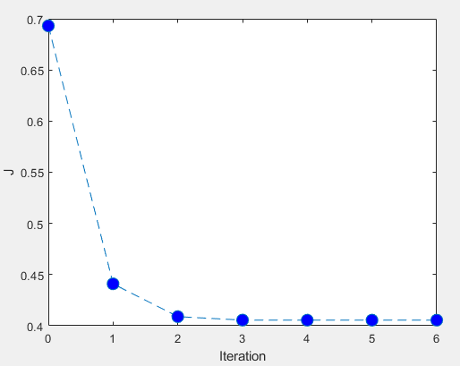

A clear decision boundary splits the two categories as accurately as possible with a linear line. 
Just like with gradient descent, we can see how the cost function converges to a minimum value. However, notice that it only takes 4 iterations for this method to converge compared to the 1500 iterations of gradient descent. This indicates that Newton's method is significantly faster than gradient descent.

With this implementation, the probability if a student will be admitted with certain exam scores can be calculated by using the following formula:

P(y=1|exam1,exam2) = 1 - sigmoid(θ1 + θ2 * exam1 + θ3 * exam2)

##### Implementation: Regulised Logistic Regression
>The files of this implementation can be found [here](Logistic%20Regression/Regulised%20Logistic%20Regression).

This implementation is my method used while following an exercise provided by the learning platform 'openclassroom' in the course *Machine Learning* found [here](http://openclassroom.stanford.edu/MainFolder/DocumentPage.php?course=MachineLearning&doc=exercises/ex5/ex5.html). This example uses regulised logistic regression to create a decision boundary that indicates whether microchips from a fabrication plan passes Quality Assurance by means of two tests. It is important to note that this implementation uses a lot of provided code from the course *Machine Learning*. This includes the following functions [mapfeature.m](Logistic%20Regression/Regulised%20Logistic%20Regression/mapFeature.m), [plotData.m](Logistic%20Regression/Regulised%20Logistic%20Regression/plotData.m), and [plotDecisionBoundary.m](Logistic%20Regression/Regulised%20Logistic%20Regression/plotDecisionBoundary.m). For the other functions, templates were used but the main code was written by myself.

Because two tests are used to assess the validation of the microchips, regulation is necessary. The regulized cost function and gradient formulas in logistic regression are respectively

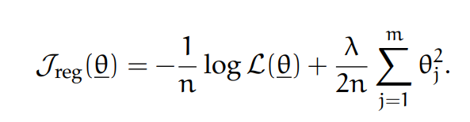

and 

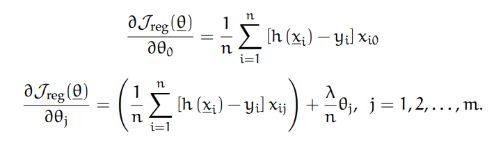

After successfully implementing these functions a clear decision boundary  is shown in the following image:

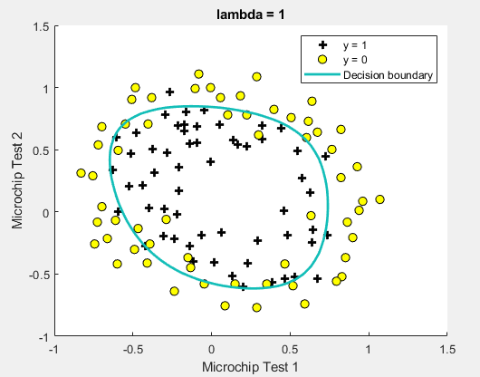

### 3 Future work
It can be very interesting to implement the regression algorithms on real datasets instead of generated or provided ones. Although I have learned a lot from these implementations, I feel that I still have a lot to discover in the field of regression. In addition, I only briefly looked at the subject of classification problems. This can be elaborated on in the future.
A final option could be to look more into the optimisation of such algorithms to possibly make them usable in real-time. 

### 4 Conclusion
Even if regression is one of the more commonly know AI-algorithms it can **not** be underestimated. However, while the statistical approach was overwhelming in the beginning, implementing them proved to clarify the meaning of each formula a lot. The concept of regression became more clear for me and I think I am capable of making basic implementations. Finally, I do not think a lot of games use or can use regression as the main gameplay feature, but I can definitely see it being used by an AI to categorise elements or make predictions to make the right decisions in given circumstances.

### 5 Sources
* [Machine learning](http://openclassroom.stanford.edu/MainFolder/CoursePage.php?course=MachineLearning) Chapters used:
  * http://openclassroom.stanford.edu/MainFolder/DocumentPage.php?course=MachineLearning&doc=exercises/ex2/ex2.html
  * http://openclassroom.stanford.edu/MainFolder/DocumentPage.php?course=MachineLearning&doc=exercises/ex3/ex3.html
  * http://openclassroom.stanford.edu/MainFolder/DocumentPage.php?course=MachineLearning&doc=exercises/ex4/ex4.html 
  * http://openclassroom.stanford.edu/MainFolder/DocumentPage.php?course=MachineLearning&doc=exercises/ex5/ex5.html
* Formullas, general information and simoid function image
  * [Supervised Learning](https://sgfin.github.io/files/notes/CS229_Lecture_Notes.pdf)
* Artificial intelligence:
  * https://www.unemyr.com/understanding-ai-algorithms/
* Regression
  * https://www.investopedia.com/terms/r/regression.asp#:~:text=Regression%20is%20a%20statistical%20method,(known%20as%20independent%20variables)
  * https://machinelearningmastery.com/supervised-and-unsupervised-machine-learning-algorithms/
  * https://www.unemyr.com/ai-algorithms-regression/
* Simple Linear regression
  * http://home.iitk.ac.in/~shalab/econometrics/Chapter2-Econometrics-SimpleLinearRegressionAnalysis.pdf
* Gradient descent
  * https://medium.com/@lachlanmiller_52885/machine-learning-week-1-cost-function-gradient-descent-and-univariate-linear-regression-8f5fe69815fd
* Multivariate regression
  * https://brilliant.org/wiki/multivariate-regression/#:~:text=Multivariate%20Regression%20is%20a%20method,responses)%2C%20are%20linearly%20related.
* Logistic regression
  * https://www.geeksforgeeks.org/understanding-logistic-regression/#:~:text=Logistic%20regression%20is%20basically%20a,regression%20IS%20a%20regression%20model.

