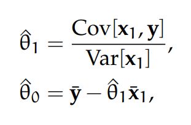
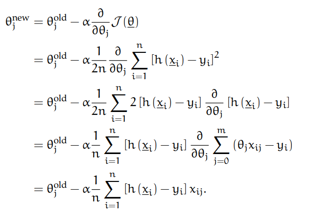

# Research Project Gameplay Programming
## Regression
### Goal

The purpose of this research is to broaden my knowledge about artificial intelligence (AI), more specifically, **regression**. This will be done by implementing a set of exercises with both self-generated data and existing datasets to get a better grasp of the subject. Both advantages and drawbacks will be discussed for each type of regression analysed during this research.

### Regression
Modern AI's are machine learning solutions created for a **specific task**. This can vary from understanding and analysing trends in market shares to finding the optimal location for a pizza shop. These AI's aren't considered *real intelligence* but use statistics and analytics to handle different problems dependant on their given training.
The way that such AI's learn can be subdivided into three categories:
* *Supervised Learning*, in which the algorithms are trained for a specific task with pre-existing datasets and human supervision.
* *Unsupervised learning*, where the algorithm looks for previously undetected patterns in pre-existing datasets with as less human supervision as possible.
* *Reinforcement Learning*, in which the algorithms learn using trial and error by adding positive and negative values to experiences and situations.

AI's that combine different aspects of learning also exist but are out of the scope of this research.

#### Supervised Learning
The most relevant training method for this research is *Supervised Learning*. During supervised learning the goal is to approximate a mapping function *f* from input *x* to output *Y* using algorithms. 

Y = f(x)

This method is referred to as supervised learning because the creator knows what the correct answers need to look like. While the algorithm makes predictions on the training data, the creator will correct if it is necessary. When a certain level of accuracy is achieved, the learning stops. Supervised learning problems can be subdivided into **classification** and **regression** problems. The output of both problems will, as their name suggests, be different. Classification problems will output a *category* and tries to classify the received datasets. Regression problems, on the other hand, predict a *numeric value in any range* as output variable, such as "height" or "speed".

This research focusses on the different types of regression algorithms, who try to predict dependant values based on known datasets. This is done by looking at the relationship between different values. The following section will explain some of the most commonly used regression algorithms followed by an implementation explaining its use.

#### Linear Regression
Linear regressiion is a frequently used method to analyze an available data set. 

##### Simple Linear Regression
###### General explenation
The most commonly used form of linear regression is known as **least squares fitting**. This form aims to fit a polynomial curve to data, in a way that the sum of squares of the distance from the line to the data points is minimized.

When the least squeres estimator of a linear regression model with a single explanatory variable is called **simple linear regression**. This fits a straight line trough a set of n points in such a way that makes the sum of squared residuals as small as possible. A visualisation of this process can be seen in the following image:

Suppose there are n training samples  <ins>x</ins>i= (1, xi1)T and yi, where i = 1, 2, ... , n. 
These samples represent the input random vector   <ins>X</ins> = (1, Xi)Tand the output random variable Y, respectively.
The following function describes <ins>x</ins> i and yi:

yi = <ins>θ</ins>T <ins>x</ins>i + ϵi = θ0 + θ1x1 + ϵi,

where <ins>θ</ins> = (θ0, θ1)T can be seen as the vector of the parameters and ϵi is the error for a pair
(xi, yi). The objective is to find the equation of the straight line:

Y = θ0 + θ1X1

This provides the most optimal fit for the data points, where the sum of squared residuals are minimized. This would mean that the y-intercept θ0 and the slope θ1 solve the following minimization problem:

By expanding to get a quadratic expression in θ0 and θ1, it can be shown that the minimizing values of θ0 and θ1 of the formula above are:

where x1 = (x11, ... , xi1, ... , xn1) and y = (y11, ... , yi1, ... , yn1) are the row
vectors that contain all sample values of the variables X1 and Y, respectively. Note that the circumflex over a quantity indicates the sample average. For a more detailed description of the simple linear regression theory, I would recommend the following sources:
* Section 3.1, Chapter 3 from the book “Pattern recognition and machine learning” of Bishop and Nasrabadi.
* https://mathworld.wolfram.com/LeastSquaresFitting.html

###### Implementation: Introduction
>The files of this implementation can be found [here](Simple%20Linear%20Regression/01_Introduction)

To understand the concept of simple linear regression I generated some experimental data adding artificial noise using the equation y = a0 + a1 * x, where a0 = 2 and a1 = 1. This is shown in the following image, containing a yellow line indicating the computed linear regression:

The regression line is calculated using built-in Matlab functions to quickly get the grasp of the concept.  
By playing with the standard deviation of the errors, it is noticeable  that the calculated regression becomes less accurate.

To simulate the effects of a random experimental error, I've repeated this process 1000 times with a fixed standard deviation of 0,1. By analysing the means in a histogram using a Gaussian curve, as shown in the image below, we notice that a0 is most likely equal to 1, and a1 = 2. Knowing that our basic function was y = 1 + 2x, we can assume that our approach was effective.

##### Gradient Descent
Gradient Descent is theoretically an algorithm that minimizes functions. This perfectly fits in the context of regression, where one tries to minimalize the sum of squared residuals. Any function can be defined by a set of parameters <ins>0</ins>. Gradient descent will initialize such a set and gradually move towards a set of parameters to minimize a cost function using calculus.

For each sample <ins>x</ins>i = (1, xi1)T the hypothesis function can be defined as

h(<ins>x</ins>i) = <ins>θ</ins>T <ins>x</ins>i = θ0 + θ1xi1,

or,

h(<ins>x</ins>i) = <ins>x</ins>iT<ins>θ</ins> = θ0 + θ1xi1,

The next step is to figure out the parameters θ = (θ0, θ1)T , which will minimize the square error between the predicted value h(<ins>x</ins>) and the actual output y for all values i in the training set. The cost function can then be noted as followed:

In this formula, n represents the number of training sets. The scaling of 1/2n is simply notational convenience. This can also be rewritten using matrix notations as

To reduce the cost function, θ will need to be updated each iteration  using the following update rule

#### Multivariate Linear Regression

#### Logistic Regression
##### Newton’s Method
##### Regulised Logistic Regression

### Conclusion

### Sources
* Machine learning Chapters used (http://openclassroom.stanford.edu/MainFolder/CoursePage.php?course=MachineLearning):
  * http://openclassroom.stanford.edu/MainFolder/DocumentPage.php?course=MachineLearning&doc=exercises/ex2/ex2.html
  * http://openclassroom.stanford.edu/MainFolder/DocumentPage.php?course=MachineLearning&doc=exercises/ex3/ex3.html
  * http://openclassroom.stanford.edu/MainFolder/DocumentPage.php?course=MachineLearning&doc=exercises/ex4/ex4.html 
  * http://openclassroom.stanford.edu/MainFolder/DocumentPage.php?course=MachineLearning&doc=exercises/ex5/ex5.html

* Artificial intelligence:
  * https://www.unemyr.com/understanding-ai-algorithms/
* Regression
  * https://www.investopedia.com/terms/r/regression.asp#:~:text=Regression%20is%20a%20statistical%20method,(known%20as%20independent%20variables)
  * https://machinelearningmastery.com/supervised-and-unsupervised-machine-learning-algorithms/
  * https://www.unemyr.com/ai-algorithms-regression/
* Simple Linear regression
 * http://home.iitk.ac.in/~shalab/econometrics/Chapter2-Econometrics-SimpleLinearRegressionAnalysis.pdf
* Gradient descent
 * https://medium.com/@lachlanmiller_52885/machine-learning-week-1-cost-function-gradient-descent-and-univariate-linear-regression-8f5fe69815fd
